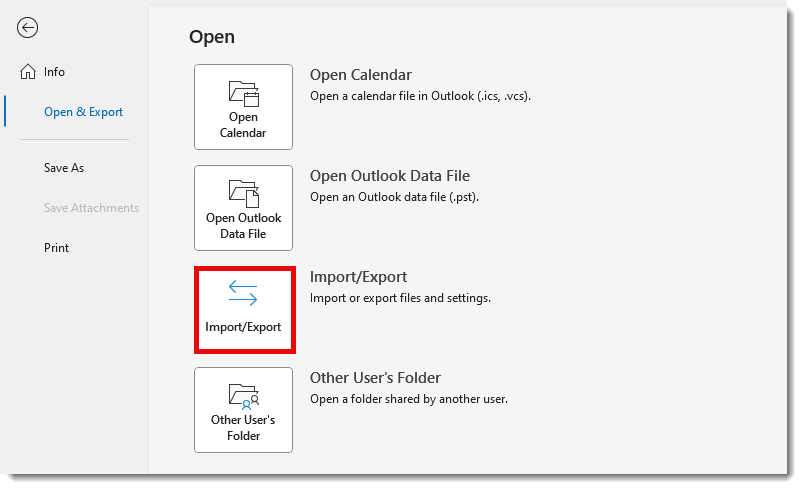
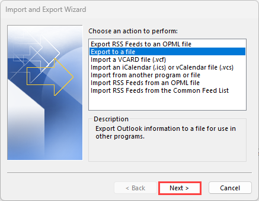
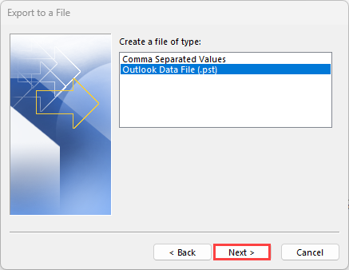
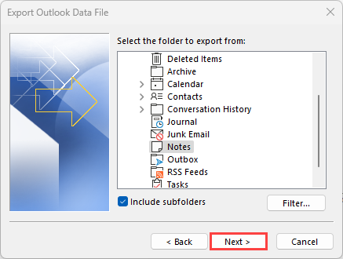
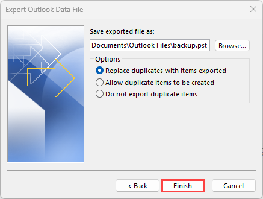

# MS Outlook: Backup your Notes to a PST file

You can create a backup of your Outlook notes by exporting them to a file. A PST, or Personal Storage Table file, is a Microsoft file format that stores data such as email messages, notes, calendar items, and contacts. It is also referred to as an Outlook Data File.

1. From Outlook, go to **File** \> **Open & Export** > **Import/Export**.

     

   
2. From the Import and Export Wizard, select **Export to a file** and then click **Next**.

     

   
3. From the Export to a File window, select **Outlook Data File (.pst)** and then click **Next**.

     

   
4. From the Export Outlook Data File window, select **Notes** and then click **Next**.

     

5. In the _Save exported file as_ field, click **Browse** to select a location to save the file and then click **Finish**.

     

> [!Note]
> The default location may be different depending on your system.  

6. _Optional_: You are prompted to create a password to protect the exported file. Enter a **Password** and **Verify Password** on the Create Outlook Data File pop-up or leave those fields blank to skip. Then click **OK**.

## Watch: Export or backup email, contacts and calendar items

<https://support.microsoft.com/en-us/office/export-emails-contacts-and-calendar-items-to-outlook-using-a-pst-file-14252b52-3075-4e9b-be4e-ff9ef1068f91>

## Related articles

- Microsoft Support: [Export emails, contacts, and calendar items to Outlook using a .pst file](https://support.microsoft.com/en-us/office/export-emails-contacts-and-calendar-items-to-outlook-using-a-pst-file-14252b52-3075-4e9b-be4e-ff9ef1068f91)
- Microsoft Support: [Import email, contacts, and calendar from an Outlook .pst file](https://support.microsoft.com/en-us/office/import-email-contacts-and-calendar-from-an-outlook-pst-file-431a8e9a-f99f-4d5f-ae48-ded54b3440ac)
